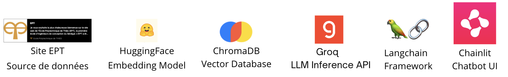

## Création d'un bot RAG de discussion sur l'Ecole Polytechnique de Thiès

Ce projet consiste à la création d'un bot capables de discuter avec les utilisateurs sur des sujet portant sur l'EPT.  
Pour se faire nous avons démarrer par un scrapping au niveau du site web de l'EPT afin de récupérer les informations sur divers domaines:
- Les concours
- La direction
- Les différents départements
- Les offres de formations

Nous utilisons Langchain pour mettre en place le bot avec la suite technologique présenté dans l'image ci-dessous.

## Structure du repository

- **chainlit_app**  contient une UI créé avec chainlit permettant de tester le bot 
- **scrapper.py** contient le code pour effectuer le scrapping au niveau du site de l'EPT
- **documents** contient les fichiers issus de l'exécution du scrapper contenant un fichier pour chaque page scrappée
- **Notebook.ipynb** notebook de travail pour la réalisation du bot avec les prompts, création des embeddings, retrieval, chaine final...

